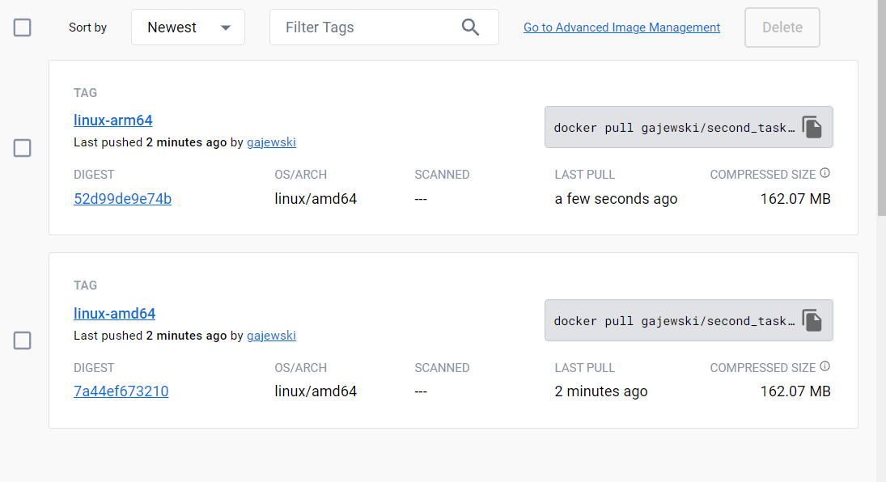
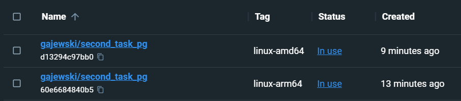

W katalogu .gitlab/workflows/ znajduje się plik opisujący łancuch Github Actions.  Klogu głównym zawiera zaś wszystkie pliki do dołączenia podczas tworzenia architektury linux/arm64/v8 oraz linux/amd64. 
## Ukazanie efektu poprawnego zbudowania się obrazów: 
*Poprawne wykonanie się Github Actions* 
  
*Dodanie obrazów do DockerHub* 
  
*Wyświetlenie się obrazów w Docker Desktop po ich pobraniu z DockerHuba* 
  
*Ukazanie utworzonych kontenerów na podstawie powyższych obrazów* 
  
*Uruchomienie kontenera na porcie 8080 wraz z wyświetlniem pliku index.php 
docker run ip 8080:8080 <nazwa obrazu>  
  
*Ukazanie logów
  
